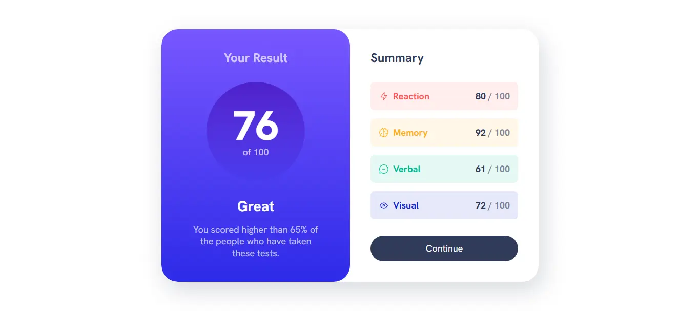

# Frontend Mentor - Results summary component solution

This is a solution to the [Results summary component challenge on Frontend Mentor](https://www.frontendmentor.io/challenges/results-summary-component-CE_K6s0maV). Frontend Mentor challenges help you improve your coding skills by building realistic projects.

## Table of contents

- [Overview](#overview)
  - [The challenge](#the-challenge)
  - [Screenshot](#screenshot)
  - [Links](#links)
- [My process](#my-process)
  - [Built with](#built-with)
  - [What I learned](#what-i-learned)
  - [Continued development](#continued-development)
  - [Useful resources](#useful-resources)
- [Author](#author)
- [Acknowledgments](#acknowledgments)

## Overview

### The challenge

Users should be able to:

- View the optimal layout for the interface depending on their device's screen size
- See hover and focus states for all interactive elements on the page
- **Bonus**: Use the local JSON data to dynamically populate the content

### Screenshot



### Links

- Solution URL: [https://www.frontendmentor.io/solutions/results-summary-component-solution-19_RH-WeP0](https://www.frontendmentor.io/solutions/results-summary-component-solution-19_RH-WeP0)
- Live Site URL: [https://heygauravshukla.github.io/results-summary-component](https://heygauravshukla.github.io/results-summary-component)

## My process

### Built with

- Semantic HTML5 markup
- CSS custom properties
- Flexbox
- CSS Grid
- Mobile-first workflow
- Self-hosted fonts

### What I learned

Using data attributes in HTML as modifiers:

```html
<div class="grid-flow" data-spacing="large"></div>
```

Using HSL colors in CSS to be able to control their opacity:

```css
:root {
  --clr-neutral-hsl-700: 224, 30%, 27%;
}

.summary-score {
  color: hsl(var(--clr-neutral-hsl-700), 0.6);
}
```

Steps to approach design-to-code implementation:

1. Writing HTML markup

- Observe the layout from desktop designs first (as they usually have more complexity than the mobile ones).
- Observe the elements with similar styling to create reusable classes.

2. Writing CSS styling

- Add any @font-face rules if using self-hosted fonts.
- Create custom properties in the :root
- Write generic styles.
- Write common styles (utility classes).
- Write layout-specific CSS.

### Continued development

In the future updates, I will try to bring the implementation closer to the design and ways to reduce code duplication.

### Useful resources

- [Kevin's YouTube video](https://youtu.be/KqFAs5d3Yl8?si=2Gi5X-1QBd0J-I7d) - This helped me to understand how to convert design to code. I really liked this pattern and will use it going forward.
- [Squoosh](https://squoosh.app) - This is a great image optimizer that helped me reduce the file size of the screenshot and convert it into .webp format.

## Author

- Website - [Gaurav Shukla](https://gshukla.vercel.app)
- Frontend Mentor - [@heygauravshukla](https://www.frontendmentor.io/profile/heygauravshukla)
- Twitter - [@heygauravshukla](https://www.twitter.com/heygauravshukla)

## Acknowledgments

I learned a lot from [Kevin Powell](https://www.youtube.com/@KevinPowell). Huge thanks to him. Also the Frontend Mentor team for providing such a rewarding challenge.
